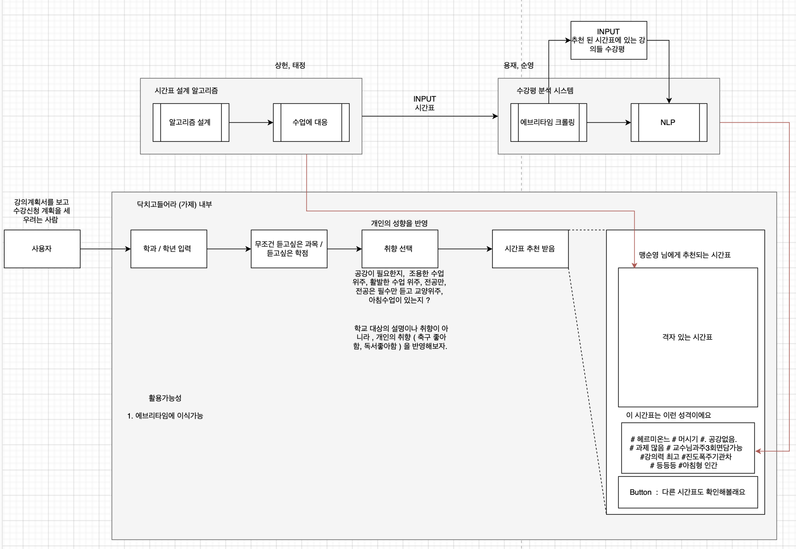

# 2021-Sejong-Fall-Hackerthon
2021 제 10회 세종대학교 가을 해커톤을 위한 리포지토리입니다.

## Team Building
|학번|이름|역할|
|------|---|---|
|18011000|조용재| 팀장, NLP, GUI |
|18011574|맹순영| NLP, GUI |
|18011549|박태정| 시간표알고리즘 설계, GUI |
|18011000|정상헌| 시간표알고리즘 설계, GUI |

# Subject
## 시간표 설계 및 추천 서비스 (서비스명 : 미정)  

## Flow Chart

## Fine  

